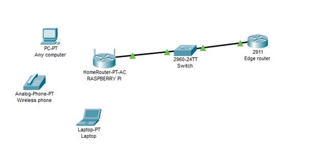

# MITM proxy hostované na RPI

## Zadání

Vytvořit MITM proxy applience která běží na Raspbian OS.

## Úvod

MITM útok je velmi jednoduchý a zároveň komplexní. Jde o to abychom raspberry připojili nebo nabourali do sítě jako prostředníka, který bude zachytávat HTTP a HTTPS requesty. Již na začátku tohoto projektu jsem věděl že bude hodně zádrhelů tudíž v následujících odstavcích se pokusím vyřešit jednotlivé problémy.
Prvním problémem je samotný MITM útok. Je několik možností jako takový útok realizovat. Můžeme například využít tak zvaný ARP poisoning. Jeho principem je velmi jednoduché zasílání modifikovaných ARP requestů který donutí systémy aktualizovat svojí ARP tabulku. Toto je ale značně intruzivní přístup tudíž druhá možnost byla napojit raspberry do sítě tak aby se opravdu stalo prostředníkem. Tento druhý způsob je pro naše demonstrační účely dostačující. Naše topologie bude tedy vypadat následovně:

 
Druhým problémem je nastavení Raspberry pi tak aby při spuštění spustilo všechny potřebné služby. Tento problém vyplívá v návaznosti, jak musí být služby spuštěny, aby nějaká služba nezpůsobila pád jiné služby. Pro minimální funkcionalitu bylo potřeba doinstalovat následující služby:
1.	ISC-dhcp-server (může být nahrazen dnsmasq ale má menší možnost nastavení)
2.	Hostapd (Proto aby raspberry mohlo fungovat jako AP router)
3.	Mitmproxy + wireshark (hlavní komponenty)
4.	IpTables (pro forwarding do mitm proxy)
Posledním problémem je nastavení MITM proxy jako samotné. Tyto aplikace má několik modů ve kterých může být spuštěna. Může běžet jako normální proxy, transparent proxy a dokonce i upstream proxy. Jelikož nevíme, jaké zařízení se připojí anebo jaké má nastavení musíme proxy nastavit do transparent modu. Takto nemusíme řešit, jestli zařízení má nebo nemá nastavení proxy.
Řešení jsem přejal z projektu dostupného z adresy: https://www.dinofizzotti.com/blog/2022-04-24-running-a-man-in-the-middle-proxy-on-a-raspberry-pi-4/.

## Hlavní změny:
1.	MITM script lokace: /home/pi/.local/scripts/start_mitm.sh
2.	Script pro spuštění
3.	/home/pi/.local/bin/mitmweb --mode transparent --web-port 9090 --web-host 127.0.0.1 --set block_global=false --certs *=/home/pi/.local/scripts/cert.pem &>> /var/log/mitmweb.log
4.	Změna block_global=false – default je true způsobí to, že pokud je adresát s globální IP adresou tak MITM proxy automaticky tento packet zahodí
5.	Certs – odkaz na private a public key pair. Musí být nastaven pro zachytávání HTTPS requestů
6.	Aplikace běží na localhost:9090

### Hostapd config
1.	SSID: KIVPSIMitmProxy
2.	Password: asdfghjkasd

## Známé problémy:

HTST – může být vypnuto v prohlížeči?
Android se nemůže napojit na AP – tato issue se hodně jednoduše replikuje, pokud má raspberry přístup do internetu

## DISCLAIMER

Image se bohužel do repozitáře nevejde tudíž přikládám odkaz na externí source
Login/Password: pi/Default123